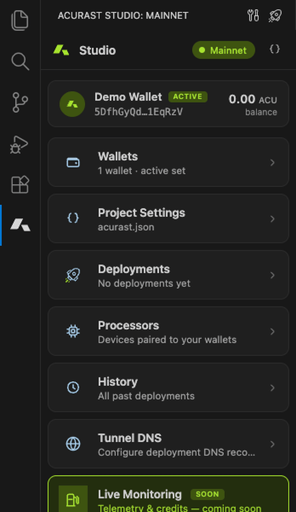

<div align="center">


# Acurast Studio

**Deploy serverless jobs to the Acurast decentralized compute network — without leaving VS Code.**

Manage encrypted wallets, edit `acurast.json`, estimate cost, and deploy to Mainnet or Canary from a single panel. The bundled `@acurast/sdk` handles signing, IPFS upload, and submission — no hand-editing `.env`.

[](https://marketplace.visualstudio.com/items?itemName=dw3labs.acurast-studio)
[](https://marketplace.visualstudio.com/items?itemName=dw3labs.acurast-studio)
[](https://marketplace.visualstudio.com/items?itemName=dw3labs.acurast-studio)
[](./LICENSE)

</div>

<div align="center">



</div>

---

## What is this?

[Acurast](https://acurast.com) is a decentralized serverless compute network built on a Substrate chain. Acurast Studio wraps the [`@acurast/sdk`](https://www.npmjs.com/package/@acurast/sdk) inside VS Code so you can go from script to a live, on-chain job in a few clicks — wallet creation, IPFS upload, cost estimate, and submission all happen in the editor.

**Who it's for:** developers building and shipping jobs to Acurast who want a guided UI instead of juggling the CLI, raw mnemonics, and `.env` files.

## Features

- 🧰 **All-in-one Studio panel** — a dedicated activity-bar view for wallets, project config, deployment, and history.
- 🔐 **Encrypted wallet vault** — create, import, rename, and delete sr25519 wallets. Mnemonics are encrypted at rest with **AES-256-GCM + PBKDF2 (210k iterations)** *inside* VS Code's SecretStorage, so even a keychain dump still needs your password.
- 🚀 **One-click deploy** — packages your script, uploads it to IPFS, and submits the job to Mainnet or Canary.
- 💸 **Cost estimation** — preview ACU spend before you deploy, with optional fiat conversion (CoinGecko / CoinMarketCap).
- 📜 **Deployment history** — a persistent, cross-workspace log of every deploy: project path, tx hash, IPFS hash, and job IDs.
- 🔗 **On-chain history** — fetch your live job registrations straight from the chain, with schedule, slots, reward, required modules, and a derived status (active / scheduled / expired).
- ✅ **`acurast.json` integration** — JSON schema validation, multi-config workspace support, and right-click "Set as active config".
- 📊 **Live balance** — wallet balance refreshes every 30 seconds while you're on the Wallets view.

## Coming soon

- 📡 **Live monitoring** — stream logs and runtime metrics from your running jobs directly in the editor.

## Getting started

1. **Install** Acurast Studio from the Marketplace.
2. **Open a workspace** that contains an `acurast.json` — or run **`Acurast: Init Project`** to scaffold one (this step uses the [`acurast` CLI](https://github.com/Acurast/acurast-cli)).
3. Click the **Acurast logo** in the activity bar to open the Studio panel.
4. **Create or import a wallet**, fund it, then hit **Deploy**.

> The extension auto-activates as soon as a workspace contains an `acurast.json`.

## Configuration

| Setting | Default | Description |
|---|---|---|
| `acurast.network` | `mainnet` | Studio target network (`mainnet` or `canary`) for balance, on-chain history, and the status bar |
| `acurast.cliPath` | `acurast` | Path to the `acurast` CLI binary, used by **Init Project** to scaffold a config. Deploy, cost estimate, and wallets use the bundled SDK and don't need it. |
| `acurast.rpcOverrides` | `{}` | Custom RPC endpoints per network |
| `acurast.matcherUrls` | `{}` | Custom matcher API endpoints per network |
| `acurast.useKeychainForMnemonic` | `true` | Store the encrypted mnemonic in the OS keychain |
| `acurast.fiat.exchangerId` | `2` | Pricing source for cost estimates — `1` CoinMarketCap, `2` CoinGecko |
| `acurast.fiat.currencyId` | `""` | Fiat currency id (e.g. `usd`). Pick it from the Settings panel; blank disables fiat conversion |
| `acurast.fiat.coingecko.plan` | `demo` | CoinGecko plan tier (`demo` or `pro`) matching your API key |

> **Note:** `acurast.network` sets the network you *monitor* (balance, history, status bar). Deploys always use the `network` field in your `acurast.json`. If the two differ, Acurast Studio shows a one-click prompt to align them.

## Commands

All commands live under the **`Acurast`** category in the Command Palette (`Cmd/Ctrl+Shift+P`).

| Command | Description |
|---|---|
| Acurast: Init Project | Scaffold an `acurast.json` in the workspace (runs the `acurast` CLI) |
| Acurast: Deploy | Deploy the active job to the network |
| Acurast: Estimate Cost | Preview ACU cost before deploying |
| Acurast: Choose acurast.json… | Switch the active config in a multi-config workspace |
| Acurast: Create Wallet | Generate a new sr25519 wallet |
| Acurast: Import Wallet | Import a wallet by mnemonic |
| Acurast: Reveal Mnemonic | Decrypt and show a wallet's mnemonic |
| Acurast: Rename Wallet | Rename a wallet |
| Acurast: Open Dashboard | Open the Acurast web dashboard |

*(Additional wallet commands — copy address, set active, delete, edit description — are also available under the same category.)*

## Requirements

- **VS Code 1.120** or newer
- A workspace containing an `acurast.json` file (use **`Acurast: Init Project`** if you don't have one yet)

## Security

Your seed phrase never leaves your machine in plaintext. Each mnemonic is encrypted with **AES-256-GCM**, keyed by **PBKDF2-SHA256 (210,000 iterations, OWASP 2023 guidance)**, and the ciphertext is what's stored in VS Code SecretStorage. Revealing a mnemonic always requires your password.

## Links

- 🌐 [Acurast website](https://acurast.com)
- 📦 [`@acurast/sdk` on npm](https://www.npmjs.com/package/@acurast/sdk)
- 🐙 [Source & issues on GitHub](https://github.com/darwinsubramaniam/acurast-studio)

## ❤️ Support development

Acurast Studio is built and maintained independently. If it saves you time, a small donation directly funds new features and ongoing maintenance. 🙏

| Network | Address |
|---|---|
| **ACU** (Acurast) | `5EqCVoSXfLwwEj7zxWvmCMvmiVXZSgeHTj5anpm4sAN6SgXp` |
| **DOT** (Polkadot) | `13mVe8hbX8DQgG8Wv9ymLWkva7XD8zCRYDp4x7kRRFPcd4ei` |

Prefer to connect a wallet? Use the **[donation page](https://darwinsubramaniam.github.io/acurast-studio-donate/)** — a non-custodial page to send ACU or DOT straight from Polkadot.js / Talisman / SubWallet. You can open it (or copy the addresses) from the **Home** panel in the extension too.

## Contributing

Issues and pull requests are welcome — see the [repository](https://github.com/darwinsubramaniam/acurast-studio).

<details>
<summary>Local development</summary>

```bash
npm install
npm run build:dev   # build extension + webview with sourcemaps
npm run watch       # watch both bundles in parallel
npm run typecheck   # type-check without emitting
npm test            # unit + integration tests
```

Press **F5** in VS Code to launch the Extension Development Host. After code changes, **Cmd+R** reloads the host (webviews don't hot-reload).

Two bundles are produced: `dist/extension.js` (Node/CJS host) and `dist/studio/webview.js` (Svelte 5 webview).

</details>

## License

[MIT](./LICENSE)
